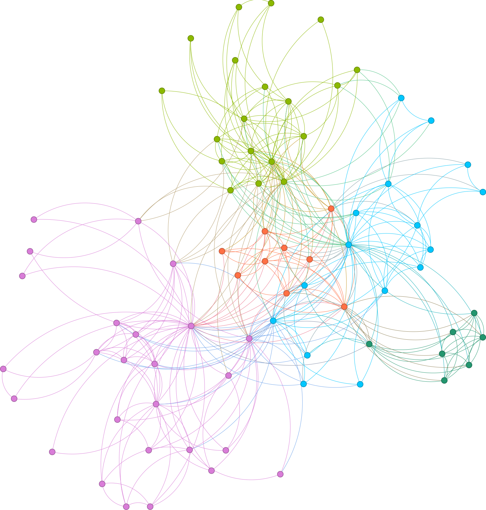
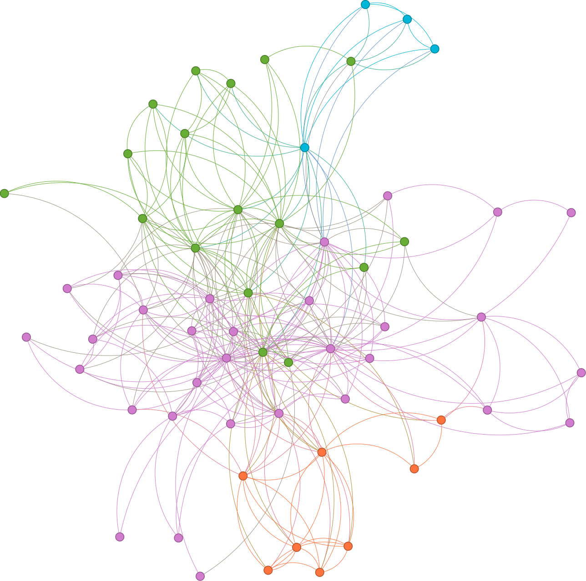
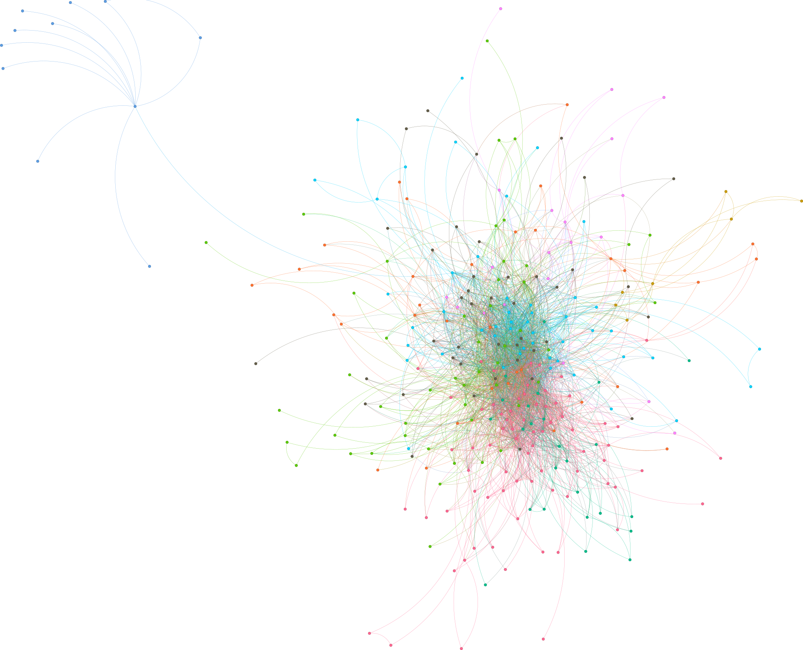

```{r setup, include=FALSE}
knitr::opts_chunk$set(echo = FALSE, warning = FALSE, message = FALSE)

set.seed(27)

got_palette <- c(  "#1A5878","#C44237","#AD8941","#E99093","#50594B","#8968CD","#9ACD32","#FFD700","#4682B4","#FFA07A","#6B8E23","#D2691E","#8A2BE2","#F08080","#708090","#20B2AA","#FF4500","#9370DB","#00CED1","#FF6347","#2E8B57","#4682B4","#FFD700","#C71585","#7B68EE","#40E0D0","#FF1493","#FF8C00","#7FFF00","#6495ED","#DC143C","#483D8B","#FF69B4","#8B0000","#32CD32","#BA55D3","#4682B4","#FFD700","#EE82EE","#B22222","#7CFC00","#DAA520","#B0C4DE","#FF4500","#9ACD32","#FF7F50","#8B4513","#BDB76B","#A52A2A","#5F9EA0","#DEB887")
```

```{r}
library(purrr)
library(igraph)
library(readr)
library(ggplot2)
library(dplyr)
library(tidygraph)
library(tidyr)
library(RSpectra)
library(lpSolve)
library(lpSolveAPI)
library(igraphwalshdata)
library(knitr)
library(kableExtra)
library(ggraph)
library(knitr)
library(kableExtra)
library(lubridate)
library(patchwork)
library(graphlayouts)
library(stringr)
```

```{r, include=FALSE}
comic_data <- read_csv("data/comic_info.csv")
marvel_df <- tibble(comic_data)

marvel_df <- marvel_df |>
  distinct()

marvel_df$Published <- mdy(marvel_df$Published)
marvel_df$Year <- year(marvel_df$Published)
marvel_df$Month <- month(marvel_df$Published)
marvel_df$Covers <- marvel_df$`Cover Artists`

marvel_df <- marvel_df |>
              filter(!is.na(Published)) |>
              select(-`Cover Artists`)

marvel_df$Writers <- str_remove_all(marvel_df$Writers,  "\\b(Not Available|Unknown|bVarious Various|Various)\\b,? ?")
marvel_df$Pencillers <- str_remove_all(marvel_df$Pencillers, "\\b(Not Available|Unknown|bVarious Various|Various)\\b,? ?")
marvel_df$Covers <- str_remove_all(marvel_df$Covers,  "\\b(Not Available|Unknown|bVarious Various|Various)\\b,? ?")

marvel_df_group_authors <- marvel_df |>
  group_by(Title) |>
  unite("Artists", Writers, Pencillers, Covers, sep=", ")

marvel_df_group_authors <- marvel_df_group_authors |>
  mutate(Artists = lapply(Artists, function(x) {
    unique(unlist(strsplit(x, ",\\s*"))) 
  })) |>
  rowwise() |>
  mutate(Artists = paste(Artists, collapse = ", ")) 


marvel_df_group_authors <- marvel_df_group_authors |> 
  separate_rows(Artists, sep = ",\\s*") |>
  filter(Artists != "") |>
  unique()

marvel_df_group_authors |> group_by(Title) |> summarise(total = n())
```

```{r, include=FALSE}
marvel_df |>
  select(Title) |>
  distinct() |>
  count()

marvel_df |>
  select(Published) |>
  summarise(first=min(Published),
            last=max(Published)
            )

marvel_df |>
  separate_rows(Writers, sep = ",\\s*") |>
  select(Writers) |>
  unique() |>
  count()

marvel_df |>
  separate_rows(Pencillers, sep = ",\\s*") |>
  select(Pencillers) |>
  unique() |>
  count()

marvel_df |>
  select(Covers) |>
  separate_rows(Covers, sep = ",\\s*") |>
  unique() |>
  count()
```

## Quali dati abbiamo a disposizione

Per rispondere alle domande che faremo durante la presentazione è stato utilizzato un dataset i cui dati sono stati raccolti da me sul sito ufficiale "<https://www.marvel.com/>"

Il dataset è composto da:

-   *36156* albi pubblicati

-   *1384* autori

-   *2237* disegnatori

-   *1269* cover artist

I dati coprono un lasso di tempo di oltre 85 anni di storia, dal 31 agosto 1939 al 30 ottobre 2024. [Include anche le pubblicazioni in programma]

## Cos'è interessante chiedersi?

Le domande a cui cercheremo di dare una risposta sono:

-   **Quali sono gli artisti più importanti che hanno lavorato su questi fumetti?**

    -   Chi è riuscito a collaborare con più colleghi (direttamente e indirettamente)

    -   Con i colleghi più influenti a loro volta

    -   Chi si trova in una posizione più influente

-   **Qual è la serie più importante?**

    -   In cui hanno lavorato i più importanti artisti

## Quando si svolgono i fatti

```{r, include=FALSE}
golden_era <- marvel_df |>
  filter(Year >= 1938 & Year <= 1956)

golden_era_aut = marvel_df_group_authors |>
  filter(Year >= 1938 & Year <= 1956)

silver_era <- marvel_df |>
  filter(Year > 1956 & Year <= 1970)

silver_era_aut <- marvel_df_group_authors |>
  filter(Year > 1956 & Year <= 1970)

bronze_era <- marvel_df |>
  filter(Year > 1970 & Year <= 1985)

bronze_era_aut <- marvel_df_group_authors |>
  filter(Year > 1970 & Year <= 1985)

modern_era <- marvel_df |>
  filter(Year > 1985)

modern_era_aut <- marvel_df_group_authors |>
  filter(Year > 1985)
```

La storia dei fumetti può essere suddivisa in quattro fasi principali:

-   *Golden Age (1938-1956)*

-   *Silver Age (1956-1970)*

-   *Bronze Age (1970-1985)*

-   *Modern Age (1985-presente)*

L'analisi prenderà in esame ciascuna di queste fasi, sia separatamente che in modo congiunto

## Panoramica dei dati

Iniziamo con un'analisi dell'andamento delle pubblicazioni nel tempo

```{r}
plot1 <- marvel_df |>
  group_by(Year) |>
  summarize(count = n()) |>
  ggplot(aes(x = Year, y = count)) +
  geom_line(size = 1, color = "steelblue") +
  theme_minimal() +
  labs(title = "", 
       x = "Anno", 
       y = "Numero di Albi")

golden_era_plot <- golden_era |> mutate(Period = "Golden Age")
silver_era_plot <- silver_era |> mutate(Period = "Silver Age")
bronze_era_plot <- bronze_era |> mutate(Period = "Bronze Age")
modern_era_plot <- modern_era |> mutate(Period = "Modern Age")

all_eras <- bind_rows(golden_era_plot, silver_era_plot, bronze_era_plot, modern_era_plot) |>
  mutate(Period = factor(Period, levels = c("Golden Age", "Silver Age", "Bronze Age", "Modern Age")))

plot2 <- all_eras |>
  group_by(Year, Period) |>
  summarize(count = n(), .groups = 'drop') |>
  ggplot(aes(x = Year, y = count, color = Period)) +
  geom_line(size = 1) +
  theme_minimal() +
  labs(title = "",
       x = "Anno",
       y = "Numero di pubblicazioni") +
  facet_wrap(~Period, scales = "free_y", ncol = 1) + 
  theme(legend.position = "none")

combined_plot <- plot1 + plot2 +
  plot_layout(ncol = 2) + 
  plot_annotation(title = "Distribuzione degli Albi Marvel nel Tempo e per Era",
                  theme = theme(plot.title = element_text(hjust = 0.5)))

combined_plot
```

Il grafico mostra un notevole aumento delle pubblicazioni a partire dagli anni '60, con un picco massimo raggiunto negli anni 2000. Negli anni più recenti si osserva una leggera diminuzione

## Panoramica dei dati - Golden Age (1938-1956)

```{r, include=FALSE}
golden_era |>
  select(Title) |>
  distinct() |>
  summarise(total= n())

golden_era |>
  select(Writers) |>
  separate_rows(Writers, sep = ",\\s*") |>
  distinct() |> 
  summarise(total= n())

golden_era |>
  select(Pencillers) |>
  separate_rows(Pencillers, sep = ",\\s*") |>
  distinct() |>
  summarise(total= n())

golden_era |>
  select(Covers) |>
  separate_rows(Covers, sep = ",\\s*") |>
  distinct() |>
  summarise(total= n())

writers_golden_era <- golden_era |>
  select(Title, Writers)

pencilers_golden_era <- golden_era |>
  select(Title, Pencillers) 

covers_golden_era <- golden_era |>
  select(Title, Covers)
```

Con una durata di 19 anni, questa era ha visto un **totale di 544 pubblicazioni**, con una **media di circa 28,63 pubblicazioni all'anno**, e la partecipazione di **42 scrittori**, **142 disegnatori** e **21 cover artist**

```{r}
golden_era_totals <- golden_era_aut|>
  group_by(Title) |>
  separate_rows(Artists, sep = ",\\s*") |>
  summarise(
    total_artists = n_distinct(Artists)
  )|>
  arrange(desc(total_artists)) 


golden_era_totals|>
  head(5) |>
  knitr::kable(
    format = "html",
    col.names = c("Titolo", "Totale"),
    align = c('l', 'c', 'c', 'c', 'c'),
    caption = "Top 5 Albi con il Maggior Numero di Artisti nella Golden Age"
  )|>
  kableExtra::kable_styling(
    bootstrap_options = c("striped", "hover", "condensed", "responsive"),
    full_width = FALSE,
    position = "center",
    font_size = 14
  )|>
  kableExtra::row_spec(0, bold = TRUE, color = "white", background = "#DC143C")
```

## Panoramica dei dati - Silver Age (1956-1970)

```{r, include=FALSE}
silver_era |>
  select(Title) |>
  distinct() |>
  summarise(total= n())

silver_era |>
  select(Writers) |>
  separate_rows(Writers, sep = ",\\s*") |>
  distinct() |> 
  summarise(total= n())

silver_era |>
  select(Pencillers) |>
  separate_rows(Pencillers, sep = ",\\s*") |>
  distinct() |>
  summarise(total= n())

silver_era |>
  select(Covers) |>
  separate_rows(Covers, sep = ",\\s*") |>
  distinct() |>
  summarise(total= n())

writers_silver_era <- silver_era |>
  select(Title, Writers)

pencilers_silver_era <- silver_era |>
  select(Title, Pencillers) 

covers_silver_era <- silver_era |>
  select(Title, Covers)
```

Questa era, durata 15 anni, ha visto un **totale di 1446 pubblicazioni**, con una **media annuale di circa 96,4 pubblicazioni**, e la partecipazione di **40 scrittori**, **88 disegnatori** e **31 cover artist**

```{r}
silver_era_totals <- silver_era_aut|>
  group_by(Title) |>
  separate_rows(Artists, sep = ",\\s*") |>
  summarise(
    total_artists = n_distinct(Artists)
  )|>
  arrange(desc(total_artists)) 


silver_era_totals|>
  head(5) |>
  knitr::kable(
    format = "html",
    col.names = c("Titolo", "Totale"),
    align = c('l', 'c', 'c', 'c', 'c'),
    caption = "Top 5 Albi con il Maggior Numero di Artisti nella Silver Age"
  )|>
  kableExtra::kable_styling(
    bootstrap_options = c("striped", "hover", "condensed", "responsive"),
    full_width = FALSE,
    position = "center",
    font_size = 14
  )|>
  kableExtra::row_spec(0, bold = TRUE, color = "white", background = "#DC143C")
```

## Panoramica dei dati - Bronze Age (1970-1985)

```{r, include=FALSE}
bronze_era |>
  select(Title) |>
  distinct() |>
  summarise(total= n())

bronze_era |>
  select(Writers) |>
  separate_rows(Writers, sep = ",\\s*") |>
  distinct() |> 
  summarise(total= n())

bronze_era |>
  select(Pencillers) |>
  separate_rows(Pencillers, sep = ",\\s*") |>
  distinct() |>
  summarise(total= n())

bronze_era |>
  select(Covers) |>
  separate_rows(Covers, sep = ",\\s*") |>
  distinct() |>
  summarise(total= n())

writers_bronze_era <- bronze_era |>
  select(Title, Writers)

pencilers_bronze_era<- bronze_era |>
  select(Title, Pencillers) 

covers_bronze_era <- bronze_era |>
  select(Title, Covers)
```

In questo periodo di 16 anni ci furono **4801 pubblicazioni**, con una **media annuale di circa 300,18 pubblicazioni**, e la partecipazione di **166 scrittori**, **265 disegnatori** e **164 cover artist**

```{r}
bronze_era_totals <- bronze_era_aut|>
  group_by(Title) |>
  separate_rows(Artists, sep = ",\\s*") |>
  summarise(
    total_artists = n_distinct(Artists)
  )|>
  arrange(desc(total_artists)) 


bronze_era_totals|>
  head(5) |>
  knitr::kable(
    format = "html",
    col.names = c("Titolo", "Totale"),
    align = c('l', 'c', 'c', 'c', 'c'),
    caption = "Top 5 Albi con il Maggior Numero di Artisti nella Bronze Age"
  )|>
  kableExtra::kable_styling(
    bootstrap_options = c("striped", "hover", "condensed", "responsive"),
    full_width = FALSE,
    position = "center",
    font_size = 14
  )|>
  kableExtra::row_spec(0, bold = TRUE, color = "white", background = "#DC143C")
```

## Panoramica dei dati - Modern Age (1985-presente)

```{r, include=FALSE}
modern_era |>
  select(Title) |>
  distinct() |>
  summarise(total= n())

modern_era |>
  select(Writers) |>
  separate_rows(Writers, sep = ",\\s*") |>
  distinct() |> 
  summarise(total= n())

modern_era |>
  select(Pencillers) |>
  separate_rows(Pencillers, sep = ",\\s*") |>
  distinct() |>
  summarise(total= n())

modern_era |>
  select(Covers) |>
  separate_rows(Covers, sep = ",\\s*") |>
  distinct() |>
  summarise(total= n())

writers_modern_era <- modern_era |>
  select(Title, Writers)

pencilers_modern_era <- modern_era |>
  select(Title, Pencillers) 

covers_modern_era <- modern_era |>
  select(Title, Covers)
```

La Modern Age è la più lunga tra tutte le ere, con una durata di oltre 40 anni fino ad oggi. In questo periodo si sono registrate **29367 pubblicazioni**, con una **media annuale di 739.40 pubblicazioni**, e la partecipazione di **1278 scrittori**, **2034 disegnatori** e **1179 cover artist**

```{r}
modern_era_totals <- modern_era_aut|>
  group_by(Title) |>
  separate_rows(Artists, sep = ",\\s*") |>
  summarise(
    total_artists = n_distinct(Artists)
  )|>
  arrange(desc(total_artists)) 


modern_era_totals|>
  head(5) |>
  knitr::kable(
    format = "html",
    col.names = c("Titolo", "Totale"),
    align = c('l', 'c', 'c', 'c', 'c'),
    caption = "Top 5 Albi con il Maggior Numero di Artisti nella Modern Age"
  )|>
  kableExtra::kable_styling(
    bootstrap_options = c("striped", "hover", "condensed", "responsive"),
    full_width = FALSE,
    position = "center",
    font_size = 14
  )|>
  kableExtra::row_spec(0, bold = TRUE, color = "white", background = "#DC143C")
```

## Panoramica dei dati - Media pubblicazioni

```{r}
era_durations <- tibble(
  Age = c("Golden Age", "Silver Age", "Bronze Age", "Modern Age"),
  Duration = c(1956 - 1938 + 1, 1970 - 1956 + 1, 1985 - 1970 + 1, 2024 - 1985 + 1)
)

normalized_df <- marvel_df |>
  mutate(Age = case_when(
    Year >= 1938 & Year <= 1956 ~ "Golden Age",
    Year > 1956 & Year <= 1970 ~ "Silver Age",
    Year > 1970 & Year <= 1985 ~ "Bronze Age",
    Year > 1985 ~ "Modern Age"
  )) |>
  count(Age) |>
  left_join(era_durations, by = "Age") |>
  mutate(Publications_per_Year = n / Duration)

normalized_df <- normalized_df |>
  mutate(Age = factor(Age, levels = c("Golden Age", "Silver Age", "Bronze Age", "Modern Age")))

normalized_df |>
  ggplot(aes(x = Age, y = Publications_per_Year, fill = Age)) +
  geom_bar(stat = "identity") +
  theme_minimal() +
  labs(title = "Numero Medio di Pubblicazioni per Anno in Ogni Era", 
       x = "Age", y = "Pubblicazioni Medie per Anno")
```

## Panoramica dei dati - Quanti posti di lavoro

```{r}
artist_trends <- marvel_df |>
  separate_rows(Writers, sep = ",\\s*")|>
  separate_rows(Pencillers, sep = ",\\s*")|>
  separate_rows(Covers, sep = ",\\s*")|>
  select(Title, Year, Writers, Pencillers, Covers) |>
  group_by(Year)|>
  summarise(
    total_writers = n_distinct(Writers),
    total_pencillers = n_distinct(Pencillers),
    total_cover_artists = n_distinct(Covers)
  )

artist_trends_long <- artist_trends|>
  pivot_longer(cols = c(total_writers, total_pencillers, total_cover_artists), 
               names_to = "Artist_Type", values_to = "Count")

artist_trends_long|>
  ggplot(aes(x = Year, y = Count, color = Artist_Type)) +
  geom_line(size = 1) +
  theme_minimal() +
  labs(title = "Andamento del Numero di Artisti per Anno",
       x = "Anno", y = "Numero di Artisti",
       color = "Tipo di Artista") +
  theme(lerand.position = "bottom")
```

Si osserva una crescita costante e rapida a partire dagli anni '60, con un picco negli anni 2000. Da notare il contro trend dei cover artist intorno agli anni 2010.

## Panoramica dei dati - Numero di artisti per albo

```{r, include=FALSE}
totals <- marvel_df |>
  unite("Artists", Writers, Pencillers, Covers, sep = ", ") |>
  separate_rows(Artists, sep = ",\\s*") |>
  filter(Artists != "") |> 
  distinct(Title, Artists, Year) |>
  group_by(Title) |>
  mutate(total_artists = n())

mean_total_artists <- totals |>
  summarise(mean_total_artists = mean(total_artists))

title_years = 
  marvel_df |>
  select(Title, Year)

summary(totals$total_artists)
```

```{r}
totals |>
  left_join(title_years, by=c("Title")) |>
  select(Year.x, total_artists) |>
  group_by(Year.x) |>
  summarise(mean_total_artists = mean(total_artists)) |>
  ggplot(aes(x = Year.x, y = mean_total_artists)) +
  geom_hline(aes(yintercept = mean(mean_total_artists)), linetype = "dashed", color = "black", size = 1) +
  geom_line(color = "blue", size = 1) +
  theme_minimal() +
  labs(title = "Numero Medio di Artisti per Albo",
       x = "Anno", y = "Numero Medio di Artisti")
```

Media di 3.78 artisti per singolo albo

## Come sono andate le collaborazioni {.black-slide}

```{r}
artists <- 
  marvel_df |>
  select(Title, Writers, Covers, Pencillers, Year) |>
  separate_rows(Writers, sep = ",\\s*") |>
  separate_rows(Covers, sep = ",\\s*") |>
  separate_rows(Pencillers, sep = ",\\s*") |>
  unique() |>
  filter(Writers != "Not Available", Writers != "Various", Writers != "Unknown") |>
  filter(Covers != "Not Available", Covers != "Various", Covers != "Unknown") |>
  filter(Pencillers != "Not Available", Pencillers != "Various", Pencillers != "Unknown") |>
  filter(Writers != "" , Pencillers != "" , Covers != "") 

golden_era_artists <-
  artists |>
  filter(Year >= 1938 & Year <= 1956)

silver_era_artists <-
  artists |>
  filter(Year > 1956 & Year <= 1970)

bronze_era_artists <-
  artists |>
  filter(Year > 1970 & Year <= 1985)

modern_era_artists <-
  artists |>
  filter(Year > 1985)
```

```{r}
collaborations <- artists |>
  pivot_longer(cols = c(Writers, Pencillers, Covers), names_to = "Role", values_to = "Artist") |>
  group_by(Title, Year)|>
  filter(n_distinct(Artist) >= 2)|>
  summarise(combinations = list(combn(unique(Artist), 2, simplify = FALSE)))|>
  unnest(combinations)|>
  mutate(From = map_chr(combinations, 1), To = map_chr(combinations, 2))|>
  select(-combinations)|>
    mutate(smaller = pmin(From, To), 
           larger = pmax(From, To))|>
    select(From = smaller, To = larger, Title, Year)|>
    group_by(From, To, Year)|>
    summarise(weight = n(), .groups = 'drop')

g <- graph_from_data_frame(collaborations, directed = FALSE)
g <- simplify(g)

V(g)$id <- as.character(V(g)$name)

V(g)$degree_size <- degree(g)
V(g)$eigen_size <-  eigen_centrality(g)$vector
V(g)$page_rank <-  page_rank(g)$vector
V(g)$closeness_centrality <- closeness(g, normalized = TRUE)
V(g)$betweenness_centrality <- betweenness(g, normalized = TRUE)

cluster_l <- cluster_louvain(g)
V(g)$clu <- as.character(membership(cluster_l))

artist_years <- marvel_df |>
  pivot_longer(cols = c(Writers, Pencillers, Covers), names_to = "Role", values_to = "Artist") |>
  select(Artist, Year)
artist_years <- artist_years |>
  group_by(Artist) |>
  summarise(first_pub = min(Year), last_pub = max(Year), .groups = 'drop')

node_data <- tibble(
  id = V(g)$name,
  degree_size = V(g)$degree_size,
  clu = V(g)$clu,
  eigen_size = V(g)$eigen_size,
  page_rank =  V(g)$page_rank,
  closeness_centrality = V(g)$closeness_centrality, 
  betweenness_centrality =  V(g)$betweenness_centrality
) |>
  left_join(artist_years, by = c("id" = "Artist"))

top_centrality <- node_data |> 
  filter(page_rank == max(page_rank) |
         betweenness_centrality == max(betweenness_centrality) |
         degree_size == max(degree_size) |
         closeness_centrality == max(closeness_centrality) |
         eigen_size == max(eigen_size)) |> 
  unique()
```

::: {style="text-align: center;"}
<figure></figure>
:::

## In tutta la storia

```{r, include=FALSE}
vcount(g)
ecount(g)
```

```{r}
node_degrees <-
  degree(g)

avg_degree <- mean(node_degrees)
max_degree_index <- which.max(node_degrees)
node_with_max_degree <- V(g)$name[max_degree_index]
p <- max(degree(g))/vcount(g)
p_m <- avg_degree/vcount(g)

artist_with_max_degree = node_data |>
  filter(id == "Mark Bagley")

mean <- max(degree(g)) / (artist_with_max_degree$last_pub - artist_with_max_degree$first_pub)
```

Dal 1939 ad oggi hanno collaborato:

-   2845 artisti in

-   35082 collaborazioni distinte

-   Mediamente un artista ha collaborato con 24.7 colleghi, circa il 0.86% del totale

-   Il più collaborativo è stato **Mark Bagley** con 313 collaborazioni, 11% del totale. Dal 1987 al 2024 per una media di 8.45 collaborazioni distinte annue.

```{r}
degree_df <- tibble(
  node = names(node_degrees),
  degree = node_degrees
)

degree_df |>
  ggplot(aes(x = degree)) +
  geom_histogram(binwidth = 1, fill = "steelblue", color = "black") +
  labs(
    title = "Distribuzione dei Gradi dei Nodi",
    x = "Grado del Nodo",
    y = "Frequenza"
  ) +
  theme_minimal()
```

```{r}
collaborations |>
  rowwise() |>
  mutate(From = pmin(From, To), To = pmax(From, To)) |>
  ungroup() |>
  group_by(From, To) |>
  summarise(total_weight = sum(weight), .groups = 'drop') |>
  arrange(desc(total_weight)) |> head(5) |>
  knitr::kable(
    format = "html",
    col.names = c("Artista 1", "Artista 2", "Collaborazioni"),
    align = c('l', 'c', 'c', 'c', 'c'),
    caption = "Artisti che hanno collaborato maggiormante"
  ) |>
  kableExtra::kable_styling(
    bootstrap_options = c("striped", "hover", "condensed", "responsive"),
    full_width = FALSE,
    position = "center",
    font_size = 14
  ) |>
  kableExtra::row_spec(0, bold = TRUE, color = "white", background = "#DC143C")
```

```{r}
mean_collaborations <- collaborations |> 
  summarise(media_weight = mean(weight))
```

-   **Brian Michael Bendis** e **Mark Bagley** si distinguono come i due artisti con il maggior numero di collaborazioni reciproche, pubblicato insieme in ben 110 occasioni.

La media di collaborazioni tra due artisti è di 1.69

## Cosa emerge

```{r}
top_centrality <- node_data |> 
  filter(page_rank == max(page_rank) |
         betweenness_centrality == max(betweenness_centrality) |
         degree_size == max(degree_size) |
         closeness_centrality == max(closeness_centrality) |
         eigen_size == max(eigen_size)) |> 
  unique()
```

**Mark Bagley** è l'artista che vanta il maggior numero di pubblicazioni con artisti differenti

**Brian Michael Bendis** si distingue per aver pubblicato frequentemente con artisti di grande rilevanza, come evidenziato dalle sue alte centralità di Eigen e PageRank.

**Christopher Eliopoulos**, **Giada Perissinotto**, **Howard Wong**, **Jean-David Morvan**, **Lanna Souvanny**, **Luca Barbieri**, **Justice Wong** e **Philippe Bouchet** sono tra gli artisti più centrali in termini di potenziale influenza su un ampio numero di colleghi, secondo la Closeness Centrality.

**Fabian Nicieza** emerge come l'artista più influente, in quanto si trova nella posizione ideale per veicolare informazioni tra diversi gruppi di artisti, come indicato dalla sua Betweeness Centrality.

Questi artisti possono essere considerati tra i più importanti alprimo colpo d'occhio. Analizzando i legami tra le varie ere si confermano questi nomi?

## Ripensando al passato…

Facciamo un passo indietro nel tempo e chiediamoci: chi erano i protagonisti delle diverse epoche?

## GOLDEN AGE {.black-slide}

**1938-1956**

::: {style="text-align: center;"}
<figure></figure>
:::

```{r}
collaborations_golden_era <- golden_era_artists |>
  pivot_longer(cols = c(Writers, Pencillers, Covers), names_to = "Role", values_to = "Artist") |>
  group_by(Title, Year) |>
  filter(n_distinct(Artist) >= 2) |>
  summarise(combinations = list(combn(unique(Artist), 2, simplify = FALSE))) |>
  unnest(combinations) |>
  mutate(From = map_chr(combinations, 1), To = map_chr(combinations, 2)) |>
  select(-combinations) |>
    mutate(smaller = pmin(From, To), 
           larger = pmax(From, To)) |>
    select(From = smaller, To = larger, Title, Year)|>
    group_by(From, To, Year) |>
    summarise(weight = n(), .groups = 'drop')

g_golden_era <- graph_from_data_frame(collaborations_golden_era, directed = FALSE)
g_golden_era <- simplify(g_golden_era)

V(g_golden_era)$id <- as.character(V(g_golden_era)$name)

V(g_golden_era)$degree_size <- degree(g_golden_era)
V(g_golden_era)$eigen_size <-  eigen_centrality(g_golden_era)$vector
V(g_golden_era)$page_rank <-  page_rank(g_golden_era)$vector
V(g_golden_era)$closeness_centrality <- closeness(g_golden_era, normalized = TRUE)
V(g_golden_era)$betweenness_centrality <- betweenness(g_golden_era, normalized = TRUE)

cluster_l <- cluster_louvain(g_golden_era)
V(g_golden_era)$clu <- as.character(membership(cluster_l))

node_data_golden_era <- tibble(
  id = V(g_golden_era)$name,
  degree_size = V(g_golden_era)$degree_size,
  clu = V(g_golden_era)$clu,
  eigen_size = V(g_golden_era)$eigen_size,
  page_rank =  V(g_golden_era)$page_rank,
  closeness_centrality = V(g_golden_era)$closeness_centrality, 
  betweenness_centrality =  V(g_golden_era)$betweenness_centrality 
)

top_centrality_gold <- node_data_golden_era |> 
  filter(page_rank == max(page_rank) |
         betweenness_centrality == max(betweenness_centrality) |
         degree_size == max(degree_size) |
         closeness_centrality == max(closeness_centrality) |
         eigen_size == max(eigen_size)) |> 
  unique()
```

## Golden Age - Dati

```{r, include=FALSE}
v_count <- vcount(g_golden_era)
e_count <- ecount(g_golden_era)

max(V(g_golden_era)$clu)
```

La rete delle collaborazioni è composta da:

-   77 artisti
-   373 collaborazioni
-   5 cluster

## Importanza nella rete

Chi sono gli artisti più importanti?

```{r}
highlighted_table <- top_centrality_gold |>
  arrange(desc(eigen_size))

max_degree_idx <- which(highlighted_table$degree_size == max(highlighted_table$degree_size, na.rm = TRUE))
max_closeness_idx <- which(highlighted_table$closeness_centrality == max(highlighted_table$closeness_centrality, na.rm = TRUE))
max_eigen_idx <- which(highlighted_table$eigen_size == max(highlighted_table$eigen_size, na.rm = TRUE))
max_pagerank_idx <- which(highlighted_table$page_rank == max(highlighted_table$page_rank, na.rm = TRUE))
max_betweeness_idx <- which(highlighted_table$betweenness_centrality == max(highlighted_table$betweenness_centrality, na.rm = TRUE))

highlighted_table |>
  knitr::kable(
    format = "html",
    escape = FALSE,
    col.names = c("", "Degree", "Cluster", "Eigen", "PageRank", "Closeness", "Betweeness"),
    align = c('l', 'c', 'c', 'c', 'c'),
    caption = "Artisti più importanti nella Golden Age"
  ) |>
  kableExtra::kable_styling(
    bootstrap_options = c("striped", "hover", "condensed", "responsive"),
    full_width = FALSE,
    position = "center",
    font_size = 14
  ) |>
  column_spec(2, 
              color = ifelse(1:nrow(highlighted_table) == max_degree_idx, "#DC143C", "black")) |>
  column_spec(4, 
              color = ifelse(1:nrow(highlighted_table) == max_eigen_idx, "#DC143C", "black")) |>
  column_spec(5, 
              color = ifelse(1:nrow(highlighted_table) == max_pagerank_idx, "#DC143C", "black")) |>
  column_spec(6, 
              color = ifelse(1:nrow(highlighted_table) == max_closeness_idx, "#DC143C", "black")) |>
  column_spec(7, 
              color = ifelse(1:nrow(highlighted_table) == max_betweeness_idx, "#DC143C", "black")) |>
  kableExtra::row_spec(0, bold = TRUE, color = "white", background = "#DC143C")
```

**Alex Schomburg** e **Stan Lee** sono i più collaborativi, hanno pubblicato insieme al 54.5% del totale degli artisti. La media delle collaborazioni si attesta al 12%.

**Syd Shores** il maggiore in Eigen Centrality

**Stan Lee** il migliore per tutte le altre

## Cluster della rete

Chi è l'artista più importante di ciascun cluster?

```{r}
top_centrality_gold_cluster <- node_data_golden_era |> 
  group_by(clu) |>
  top_n(1, eigen_size) |>
  filter(page_rank == max(page_rank) |
         betweenness_centrality == max(betweenness_centrality) |
         degree_size == max(degree_size) |
         closeness_centrality == max(closeness_centrality) |
         eigen_size == max(eigen_size)) |> 
  unique()

highlighted_table <- top_centrality_gold_cluster |>
  arrange(desc(eigen_size))

max_degree_idx <- which(highlighted_table$degree_size == max(highlighted_table$degree_size, na.rm = TRUE))
max_closeness_idx <- which(highlighted_table$closeness_centrality == max(highlighted_table$closeness_centrality, na.rm = TRUE))
max_eigen_idx <- which(highlighted_table$eigen_size == max(highlighted_table$eigen_size, na.rm = TRUE))
max_pagerank_idx <- which(highlighted_table$page_rank == max(highlighted_table$page_rank, na.rm = TRUE))
max_betweeness_idx <- which(highlighted_table$betweenness_centrality == max(highlighted_table$betweenness_centrality, na.rm = TRUE))

highlighted_table |>
  knitr::kable(
    format = "html",
    escape = FALSE,
    col.names = c("", "Degree", "Cluster", "Eigen", "PageRank", "Closeness", "Betweeness"),
    align = c('l', 'c', 'c', 'c', 'c'),
    caption = "Artisti più importanti nella Golden Age"
  ) |>
  kableExtra::kable_styling(
    bootstrap_options = c("striped", "hover", "condensed", "responsive"),
    full_width = FALSE,
    position = "center",
    font_size = 14
  ) |>
  column_spec(2, 
              color = ifelse(1:nrow(highlighted_table) == max_degree_idx, "#DC143C", "black")) |>
  column_spec(4, 
              color = ifelse(1:nrow(highlighted_table) == max_eigen_idx, "#DC143C", "black")) |>
  column_spec(5, 
              color = ifelse(1:nrow(highlighted_table) == max_pagerank_idx, "#DC143C", "black")) |>
  column_spec(6, 
              color = ifelse(1:nrow(highlighted_table) == max_closeness_idx, "#DC143C", "black")) |>
  column_spec(7, 
              color = ifelse(1:nrow(highlighted_table) == max_betweeness_idx, "#DC143C", "black")) |>
  kableExtra::row_spec(0, bold = TRUE, color = "white", background = "#DC143C")
```

```{r}
ggraph(g_golden_era, layout = "auto") +
  geom_edge_link(aes(edge_alpha = ..index.., curvature = 0.2), edge_colour = "grey", linejoin = "round") +
  geom_node_point(aes(fill = clu, size = degree_size), shape = 21) +
  geom_node_text(aes(filter = id %in% union(top_centrality_gold$id, top_centrality_gold_cluster$id), label = id), family = "ubuntu-mono", size = 3, color = "black", fontface = "bold") +   
  scale_fill_manual(values = got_palette) +
  scale_edge_width(range = c(0.2, 3)) +
  scale_size(range = c(1, 6)) +
  theme_graph() +
  theme(legend.position = "none") +
  labs(title = "Cluster e nodi più importanti")
```

## Collaborazioni nei gruppi

```{r}
memberships <- membership(cluster_l)

data <- collaborations_golden_era |>
  rowwise() |>
  mutate(com1 = memberships[V(g_golden_era)$name[which(V(g_golden_era)$name == From)]],
         com2 = memberships[V(g_golden_era)$name[which(V(g_golden_era)$name == To)]])

growth <- data |>
  filter(com1 == com2) |> 
  group_by(Year, com1) |>
  summarise(count = n(), .groups = 'drop')

ggplot(growth, aes(x = Year, y = count, color = as.factor(com1))) +
  geom_line() +
  geom_point(size = 2, shape = 21, fill = "white") +
  labs(title = "Crescita delle Collaborazioni nei Cluster nel Tempo",
       x = "Anno",
       y = "Numero di Collaborazioni",
       color = "Comunità") +
  theme_minimal()
```

Il cluster 3 è quello più duraturo e forte di questa era.

**Stan Lee** è l'attore principle del cluster

## Legacy

Alex Schomburg, Jack Kirby, Ray Gill, **Stan Lee** e Syd Shores sono i maggiori protagonisti. Cosa è nato da loro?

## SILVER AGE {.black-slide}

**1956-1970**

::: {style="text-align: center;"}
<figure></figure>
:::

```{r}
collaborations_silver_era = silver_era_artists |>
  pivot_longer(cols = c(Writers, Pencillers, Covers), names_to = "Role", values_to = "Artist") |>
  group_by(Title, Year) |>
  filter(n_distinct(Artist) >= 2) |>
  summarise(combinations = list(combn(unique(Artist), 2, simplify = FALSE))) |>
  unnest(combinations) |>
  mutate(From = map_chr(combinations, 1), To = map_chr(combinations, 2)) |>
  select(-combinations) |>
    mutate(smaller = pmin(From, To), 
           larger = pmax(From, To)) |>
    select(From = smaller, To = larger, Title, Year)|>
    group_by(From, To, Year) |>
    summarise(weight = n(), .groups = 'drop')


g_silver_era <- graph_from_data_frame(collaborations_silver_era, directed = FALSE)
g_silver_era <- simplify(g_silver_era)

V(g_silver_era)$id <- as.character(V(g_silver_era)$name)

V(g_silver_era)$degree_size <- degree(g_silver_era)
V(g_silver_era)$eigen_size <-  eigen_centrality(g_silver_era)$vector
V(g_silver_era)$page_rank <-  page_rank(g_silver_era)$vector
V(g_silver_era)$closeness_centrality <- closeness(g_silver_era, normalized = TRUE)
V(g_silver_era)$betweenness_centrality <- betweenness(g_silver_era, normalized = TRUE)

cluster_l <- cluster_louvain(g_silver_era)
V(g_silver_era)$clu <- as.character(membership(cluster_l))

node_data_silver_era <- tibble(
  id = V(g_silver_era)$name,
  degree_size = V(g_silver_era)$degree_size,
  clu = V(g_silver_era)$clu,
  eigen_size = V(g_silver_era)$eigen_size,
  page_rank =  V(g_silver_era)$page_rank,
  closeness_centrality = V(g_silver_era)$closeness_centrality, 
  betweenness_centrality =  V(g_silver_era)$betweenness_centrality 
)

top_centrality_silver <- node_data_silver_era |> 
  filter(page_rank == max(page_rank) |
         betweenness_centrality == max(betweenness_centrality) |
         degree_size == max(degree_size) |
         closeness_centrality == max(closeness_centrality) |
         eigen_size == max(eigen_size)) |> 
  unique()
```

## Silver Age - Dati

```{r, include=FALSE}
v_count <- vcount(g_silver_era)
e_count <- ecount(g_silver_era)

max(V(g_silver_era)$clu)
```

La rete delle collaborazioni è composta da:

-   60 artisti
-   294 pubblicazioni
-   4 cluster

## Importanza nella rete

Chi sono gli artisti più importanti?

```{r}
highlighted_table <- top_centrality_silver|>
  arrange(desc(eigen_size))

max_degree_idx <- which(highlighted_table$degree_size == max(highlighted_table$degree_size, na.rm = TRUE))
max_closeness_idx <- which(highlighted_table$closeness_centrality == max(highlighted_table$closeness_centrality, na.rm = TRUE))
max_eigen_idx <- which(highlighted_table$eigen_size == max(highlighted_table$eigen_size, na.rm = TRUE))
max_pagerank_idx <- which(highlighted_table$page_rank == max(highlighted_table$page_rank, na.rm = TRUE))
max_betweeness_idx <- which(highlighted_table$betweenness_centrality == max(highlighted_table$betweenness_centrality, na.rm = TRUE))

highlighted_table |>
  knitr::kable(
    format = "html",
    escape = FALSE,
    col.names = c("", "Degree", "Cluster", "Eigen", "PageRank", "Closeness", "Betweeness"),
    align = c('l', 'c', 'c', 'c', 'c'),
    caption = "Artisti più importanti nella Silver Age"
  ) |>
  kableExtra::kable_styling(
    bootstrap_options = c("striped", "hover", "condensed", "responsive"),
    full_width = FALSE,
    position = "center",
    font_size = 14
  ) |>
  column_spec(2, 
              color = ifelse(1:nrow(highlighted_table) == max_degree_idx, "#DC143C", "black")) |>
  column_spec(4, 
              color = ifelse(1:nrow(highlighted_table) == max_eigen_idx, "#DC143C", "black")) |>
  column_spec(5, 
              color = ifelse(1:nrow(highlighted_table) == max_pagerank_idx, "#DC143C", "black")) |>
  column_spec(6, 
              color = ifelse(1:nrow(highlighted_table) == max_closeness_idx, "#DC143C", "black")) |>
  column_spec(7, 
              color = ifelse(1:nrow(highlighted_table) == max_betweeness_idx, "#DC143C", "black")) |>
  kableExtra::row_spec(0, bold = TRUE, color = "white", background = "#DC143C")
```

**Roy Thomas** più collaborativo, ha pubblicato insieme al 61.7% del totale degli artisti. La media delle collaborazioni si attesta al 16.3%.

**Stan Lee** il maggiore in EigenValue e PageRank

**Gene Colan** il migliore per Closeness

**Don Heck** il migliore per Betweeness

## Cluster della rete

Chi è l'artista più importante di ciascun cluster?

```{r}
top_centrality_silver_cluster <- node_data_silver_era |> 
  group_by(clu) |>
  top_n(1, eigen_size) |>
  filter(page_rank == max(page_rank) |
         betweenness_centrality == max(betweenness_centrality) |
         degree_size == max(degree_size) |
         closeness_centrality == max(closeness_centrality) |
         eigen_size == max(eigen_size)) |> 
  unique()


highlighted_table <- top_centrality_silver_cluster |>
  arrange(desc(eigen_size))

max_degree_idx <- which(highlighted_table$degree_size == max(highlighted_table$degree_size, na.rm = TRUE))
max_closeness_idx <- which(highlighted_table$closeness_centrality == max(highlighted_table$closeness_centrality, na.rm = TRUE))
max_eigen_idx <- which(highlighted_table$eigen_size == max(highlighted_table$eigen_size, na.rm = TRUE))
max_pagerank_idx <- which(highlighted_table$page_rank == max(highlighted_table$page_rank, na.rm = TRUE))
max_betweeness_idx <- which(highlighted_table$betweenness_centrality == max(highlighted_table$betweenness_centrality, na.rm = TRUE))

highlighted_table |>
  knitr::kable(
    format = "html",
    escape = FALSE,
    col.names = c("", "Degree", "Cluster", "Eigen", "PageRank", "Closeness", "Betweeness"),
    align = c('l', 'c', 'c', 'c', 'c'),
    caption = "Artisti più importanti nella Silver Age"
  ) |>
  kableExtra::kable_styling(
    bootstrap_options = c("striped", "hover", "condensed", "responsive"),
    full_width = FALSE,
    position = "center",
    font_size = 14
  ) |>
  column_spec(2, 
              color = ifelse(1:nrow(highlighted_table) == max_degree_idx, "#DC143C", "black")) |>
  column_spec(4, 
              color = ifelse(1:nrow(highlighted_table) == max_eigen_idx, "#DC143C", "black")) |>
  column_spec(5, 
              color = ifelse(1:nrow(highlighted_table) == max_pagerank_idx, "#DC143C", "black")) |>
  column_spec(6, 
              color = ifelse(1:nrow(highlighted_table) == max_closeness_idx, "#DC143C", "black")) |>
  column_spec(7, 
              color = ifelse(1:nrow(highlighted_table) == max_betweeness_idx, "#DC143C", "black")) |>
  kableExtra::row_spec(0, bold = TRUE, color = "white", background = "#DC143C")
```

```{r}
ggraph(g_silver_era, layout = "auto") +
  geom_edge_link(aes(edge_alpha = ..index.., curvature = 0.2), edge_colour = "grey", linejoin = "round") +
  geom_node_point(aes(fill = clu, size = degree_size), shape = 21) +
  geom_node_text(aes(filter = id %in% union(top_centrality_silver$id, top_centrality_silver_cluster$id), label = id), family = "ubuntu-mono", size = 3, color = "black", fontface = "bold") +   
  scale_fill_manual(values = got_palette) +
  scale_edge_width(range = c(0.2, 3)) +
  scale_size(range = c(1, 6)) +
  theme_graph() +
  theme(legend.position = "none") +
  labs(title = "Cluster e nodi più importanti")
```

## Collaborazioni nei gruppi

```{r}
memberships <- membership(cluster_l)

data <- collaborations_silver_era |>
  rowwise() |>
  mutate(com1 = memberships[V(g_silver_era)$name[which(V(g_silver_era)$name == From)]],
         com2 = memberships[V(g_silver_era)$name[which(V(g_silver_era)$name == To)]])

growth <- data |>
  filter(com1 == com2) |> 
  group_by(Year, com1) |>
  summarise(count = n(), .groups = 'drop')

ggplot(growth, aes(x = Year, y = count, color = as.factor(com1))) +
  geom_line() +
  geom_point(size = 2, shape = 21, fill = "white") +
  labs(title = "Crescita delle Collaborazioni nei Cluster nel Tempo",
       x = "Anno",
       y = "Numero di Collaborazioni",
       color = "Comunità") +
  theme_minimal()
```

Il cluster 2 è quello più duraturo e forte di quest'era

**Stan Lee** è l'attore principle del cluster. Continua ad essere importante dall'era precedente

## Legacy

Don Heck, Gene Colan, Bill Everett, Dick Ayers, Roy Thomas, **Stan Lee** sono i più importanti di quest'era

**Stan Lee** lo era anche nell'era precedente, ma gli altri hanno collaborato con quelli più importanti degli anni passati?

```{r}
union_gold <- union(top_centrality_gold$id, top_centrality_gold_cluster$id)
union_silver <- union(top_centrality_silver$id, top_centrality_silver_cluster$id)
color_gold <- rep("gold", length(union_gold))
color_silver <- rep("grey", length(union_silver))

most_important_nodes <- append(union_gold, union_silver)

era <- append(color_gold, color_silver)

sub_g <- induced_subgraph(g, vids = V(g)[name %in% most_important_nodes])
node_info <- tibble(
  name = most_important_nodes,
  era = era
)

V(sub_g)$era <- NA
V(sub_g)$era[V(sub_g)$name %in% node_info$name] <- node_info$era[match(V(sub_g)$name[V(sub_g)$name %in% node_info$name], node_info$name)]

components <- components(sub_g)

largest_component <- which.max(components$csize)
nodes_largest_component <- which(components$membership == largest_component)
sub_g_largest_component <- induced_subgraph(sub_g, vids = nodes_largest_component)

V(sub_g_largest_component)$importance = eigen_centrality(sub_g_largest_component)$vector
max_importance <- max(V(sub_g_largest_component)$importance, na.rm = TRUE)
index_max_importance <- which(V(sub_g_largest_component)$importance == max_importance)
important_edges <- incident(sub_g_largest_component, V(sub_g_largest_component)[index_max_importance], mode = "all")

E(sub_g_largest_component)$is_important <- FALSE
E(sub_g_largest_component)$is_important[important_edges] <- TRUE

layout<- layout_igraph_focus_group(sub_g_largest_component, group = V(sub_g_largest_component)$era, v=V(sub_g_largest_component)[index_max_importance])

ggraph(sub_g_largest_component, layout = layout) +
  geom_edge_link(aes(edge_alpha = ..index.., curvature = 0.2, color = is_important), linejoin = "round") +
  scale_edge_color_manual(values = c("FALSE" = "grey", "TRUE" = "red")) + 
  geom_node_point(aes(color = factor(era)), size = 5) +
  geom_node_text(aes(label = name), family = "ubuntu-mono", size = 3, color = "black", fontface = "bold") +
  scale_color_manual(values = c("gold" = "gold", "silver" = "grey")) +
  scale_edge_width(range = c(0.2, 3)) +
  scale_size(range = c(1, 6)) +
  theme_graph() +
  theme(legend.position = "none")
```

## BRONZE ERA {.black-slide}

**1970-1985**

::: {style="text-align: center;"}
<figure></figure>
:::

```{r}
collaborations_bronze_era <- bronze_era_artists |>
  pivot_longer(cols = c(Writers, Pencillers, Covers), names_to = "Role", values_to = "Artist") |>
  group_by(Title, Year) |>
  filter(n_distinct(Artist) >= 2) |>
  summarise(combinations = list(combn(unique(Artist), 2, simplify = FALSE))) |>
  unnest(combinations) |>
  mutate(From = map_chr(combinations, 1), To = map_chr(combinations, 2)) |>
  select(-combinations) |>
    mutate(smaller = pmin(From, To), 
           larger = pmax(From, To)) |>
    select(From = smaller, To = larger, Title, Year)|>
    group_by(From, To, Year) |>
    summarise(weight = n(), .groups = 'drop')

g_bronze_era <- graph_from_data_frame(collaborations_bronze_era, directed = FALSE)
g_bronze_era <- simplify(g_bronze_era)

V(g_bronze_era)$id <- as.character(V(g_bronze_era)$name)

V(g_bronze_era)$degree_size <- degree(g_bronze_era)
V(g_bronze_era)$eigen_size <-  eigen_centrality(g_bronze_era)$vector
V(g_bronze_era)$page_rank <-  page_rank(g_bronze_era)$vector
V(g_bronze_era)$closeness_centrality <- closeness(g_bronze_era, normalized = TRUE)
V(g_bronze_era)$betweenness_centrality <- betweenness(g_bronze_era, normalized = TRUE)

cluster_l <- cluster_louvain(g_bronze_era)
V(g_bronze_era)$clu <- as.numeric(membership(cluster_l))

node_data_bronze_era <- tibble(
  id = V(g_bronze_era)$name,
  degree_size = V(g_bronze_era)$degree_size,
  clu = V(g_bronze_era)$clu,
  eigen_size = V(g_bronze_era)$eigen_size,
  page_rank =  V(g_bronze_era)$page_rank,
  closeness_centrality = V(g_bronze_era)$closeness_centrality, 
  betweenness_centrality =  V(g_bronze_era)$betweenness_centrality 
)

top_centrality_bronze <- node_data_bronze_era |> 
  filter(page_rank == max(page_rank) |
         betweenness_centrality == max(betweenness_centrality) |
         degree_size == max(degree_size) |
         closeness_centrality == max(closeness_centrality) |
         eigen_size == max(eigen_size)) |> 
  unique()
```

## Bronze Age - Dati

```{r, include=FALSE}
v_count <- vcount(g_bronze_era)
e_count <- ecount(g_bronze_era)

max(V(g_bronze_era)$clu)
```

La rete delle collaborazioni è composta da:

-   308 artisti
-   2759 pubblicazioni
-   8 cluster

## Importanza nella rete

Chi sono gli artisti più importanti?

```{r}
highlighted_table <- top_centrality_bronze |>
  arrange(desc(clu))

max_degree_idx <- which(highlighted_table$degree_size == max(highlighted_table$degree_size, na.rm = TRUE))
max_closeness_idx <- which(highlighted_table$closeness_centrality == max(highlighted_table$closeness_centrality, na.rm = TRUE))
max_eigen_idx <- which(highlighted_table$eigen_size == max(highlighted_table$eigen_size, na.rm = TRUE))
max_pagerank_idx <- which(highlighted_table$page_rank == max(highlighted_table$page_rank, na.rm = TRUE))
max_betweeness_idx <- which(highlighted_table$betweenness_centrality == max(highlighted_table$betweenness_centrality, na.rm = TRUE))

highlighted_table |>
  knitr::kable(
    format = "html",
    escape = FALSE,
    col.names = c("", "Degree", "Cluster", "Eigen", "PageRank", "Closeness", "Betweeness"),
    align = c('l', 'c', 'c', 'c', 'c'),
    caption = "Artisti più importanti nella Bronze Age"
  ) |>
  kableExtra::kable_styling(
    bootstrap_options = c("striped", "hover", "condensed", "responsive"),
    full_width = FALSE,
    position = "center",
    font_size = 14
  ) |>
  column_spec(2, 
              color = ifelse(1:nrow(highlighted_table) == max_degree_idx, "#DC143C", "black")) |>
  column_spec(4, 
              color = ifelse(1:nrow(highlighted_table) == max_eigen_idx, "#DC143C", "black")) |>
  column_spec(5, 
              color = ifelse(1:nrow(highlighted_table) == max_pagerank_idx, "#DC143C", "black")) |>
  column_spec(6, 
              color = ifelse(1:nrow(highlighted_table) == max_closeness_idx, "#DC143C", "black")) |>
  column_spec(7, 
              color = ifelse(1:nrow(highlighted_table) == max_betweeness_idx, "#DC143C", "black")) |>
  kableExtra::row_spec(0, bold = TRUE, color = "white", background = "#DC143C")
```

**Ron Wilson** più collaborativo, ha pubblicato insieme al 36% del totale degli artisti. La media delle pubblicazioni si attesta al 5,8%. Inoltre è il migliore per Closeness

**Gil Kane** il maggiore in EigenValue e PageRank

**Fred Hembeck** il migliore per Betweeness

## Cluster della rete

Chi è l'artista più importante di ciascun cluster?

```{r}
top_centrality_bronze_cluster <- node_data_bronze_era |> 
  group_by(clu) |>
  top_n(1, eigen_size) |>
  filter(page_rank == max(page_rank) |
         betweenness_centrality == max(betweenness_centrality) |
         degree_size == max(degree_size) |
         closeness_centrality == max(closeness_centrality) |
         eigen_size == max(eigen_size)) |> 
  unique()

highlighted_table <- top_centrality_bronze_cluster |>
  arrange(desc(eigen_size))

max_degree_idx <- which(highlighted_table$degree_size == max(highlighted_table$degree_size, na.rm = TRUE))
max_closeness_idx <- which(highlighted_table$closeness_centrality == max(highlighted_table$closeness_centrality, na.rm = TRUE))
max_eigen_idx <- which(highlighted_table$eigen_size == max(highlighted_table$eigen_size, na.rm = TRUE))
max_pagerank_idx <- which(highlighted_table$page_rank == max(highlighted_table$page_rank, na.rm = TRUE))
max_betweeness_idx <- which(highlighted_table$betweenness_centrality == max(highlighted_table$betweenness_centrality, na.rm = TRUE))

highlighted_table |>
  knitr::kable(
    format = "html",
    escape = FALSE,
    col.names = c("", "Degree", "Cluster", "Eigen", "PageRank", "Closeness", "Betweeness"),
    align = c('l', 'c', 'c', 'c', 'c'),
    caption = "Artisti più importanti nella Bronze Age"
  ) |>
  kableExtra::kable_styling(
    bootstrap_options = c("striped", "hover", "condensed", "responsive"),
    full_width = FALSE,
    position = "center",
    font_size = 14
  ) |>
  column_spec(2, 
              color = ifelse(1:nrow(highlighted_table) == max_degree_idx, "#DC143C", "black")) |>
  column_spec(4, 
              color = ifelse(1:nrow(highlighted_table) == max_eigen_idx, "#DC143C", "black")) |>
  column_spec(5, 
              color = ifelse(1:nrow(highlighted_table) == max_pagerank_idx, "#DC143C", "black")) |>
  column_spec(6, 
              color = ifelse(1:nrow(highlighted_table) == max_closeness_idx, "#DC143C", "black")) |>
  column_spec(7, 
              color = ifelse(1:nrow(highlighted_table) == max_betweeness_idx, "#DC143C", "black")) |>
  kableExtra::row_spec(0, bold = TRUE, color = "white", background = "#DC143C")
```

```{r}
ggraph(g_bronze_era, layout = "centrality", centrality = V(g_bronze_era)$eigen_size) +
  geom_edge_link(aes(edge_alpha = ..index.., curvature = 0.2), edge_colour = "grey", linejoin = "round") +
  geom_node_point(aes(fill = as.factor(clu), size = degree_size), shape = 21) +
  geom_node_text(aes(filter = id %in% union(top_centrality_bronze$id, top_centrality_bronze_cluster$id), label = id), family = "ubuntu-mono", size = 3, color = "black", fontface = "bold") +   
  scale_fill_manual(values = got_palette) +
  scale_edge_width(range = c(0.2, 3)) +
  scale_size(range = c(1, 6)) +
  theme_graph() +
  theme(legend.position = "none") +
  labs(title = "Cluster e nodi più importanti")
```

## Collaborazioni nei gruppi

```{r}
memberships <- membership(cluster_l)

data <- collaborations_bronze_era |>
  rowwise() |>
  mutate(com1 = memberships[V(g_bronze_era)$name[which(V(g_bronze_era)$name == From)]],
         com2 = memberships[V(g_bronze_era)$name[which(V(g_bronze_era)$name == To)]])

growth <- data |>
  filter(com1 == com2) |> 
  group_by(Year, com1) |>
  summarise(count = n(), .groups = 'drop')

gg <- growth |> group_by(com1) |> summarise(sum(count))

ggplot(growth, aes(x = Year, y = count, color = as.factor(com1))) +
  geom_line() +
  geom_point(size = 2, shape = 21, fill = "white") +
  labs(title = "Crescita delle collaborazioni nei Cluster nel Tempo",
       x = "Anno",
       y = "Numero di Collaborazioni",
       color = "Comunità") +
  theme_minimal()
```

Tutti i cluster hanno la stessa durata ma il 2 è quello più rilevante con un totale di 374 collaborazioni

**Gil Kane** è l'attore pricipale del cluster

## Legacy

Bill Mantlo, Chris Claremont, Don Perlin, Doug Moench, John Romita Jr., Marv Wolfman, Val Mayerik, Warren Kremer, Fred Hembeck, Gil Kane, Ron Wilson sono gli attori più importanti di questa era

```{r}
union_bronze <- union(top_centrality_bronze$id, top_centrality_bronze_cluster$id)
color_bronze <- rep("bronze", length(union_bronze))

most_important_nodes <- append(append(union_gold, union_silver), union_bronze)

era = append(append(color_gold, color_silver), color_bronze)

sub_g <- induced_subgraph(g, vids = V(g)[name %in% most_important_nodes])
node_info <- tibble(
  name = most_important_nodes,
  era = era
)

V(sub_g)$era <- NA
V(sub_g)$era[V(sub_g)$name %in% node_info$name] <- node_info$era[match(V(sub_g)$name[V(sub_g)$name %in% node_info$name], node_info$name)]

components <- components(sub_g)

largest_component <- which.max(components$csize)
nodes_largest_component <- which(components$membership == largest_component)
sub_g_largest_component <- induced_subgraph(sub_g, vids = nodes_largest_component)

V(sub_g_largest_component)$importance = eigen_centrality(sub_g_largest_component)$vector
max_importance <- max(V(sub_g_largest_component)$importance, na.rm = TRUE)
index_max_importance <- which(V(sub_g_largest_component)$importance == max_importance)
important_edges <- incident(sub_g_largest_component, V(sub_g_largest_component)[index_max_importance], mode = "all")

E(sub_g_largest_component)$is_important <- FALSE
E(sub_g_largest_component)$is_important[important_edges] <- TRUE

layout<- layout_igraph_focus_group(sub_g_largest_component, group = V(sub_g_largest_component)$era, v=V(sub_g_largest_component)[index_max_importance])

ggraph(sub_g_largest_component, layout = layout) +
  geom_edge_link(aes(edge_alpha = ..index.., curvature = 0.2, color = is_important), linejoin = "round") +
  scale_edge_color_manual(values = c("FALSE" = "grey", "TRUE" = "red")) +
  geom_edge_link(aes(edge_alpha = ..index.., curvature = 0.2), edge_colour = "grey", linejoin = "round") +
  geom_edge_link(aes(edge_alpha = ..index..), edge_colour = "grey") +
  geom_node_point(aes(color = factor(era)), size = 5) +
  geom_node_text(aes(label = name), family = "ubuntu-mono", size = 3, color = "black", fontface = "bold") +
  scale_color_manual(values = c("gold" = "gold", "silver" = "grey", "bronze" = "brown")) +
  scale_edge_width(range = c(0.2, 3)) +
  scale_size(range = c(1, 6)) +
  theme_graph() +
  theme(legend.position = "none")
```

## MODERN AGE {.black-slide}

**1970-1985**

::: {style="text-align: center;"}
<figure></figure>
:::

```{r}
collaborations_modern_era <- modern_era_artists |>
  pivot_longer(cols = c(Writers, Pencillers, Covers), names_to = "Role", values_to = "Artist") |>
  group_by(Title, Year) |>
  filter(n_distinct(Artist) >= 2) |>
  summarise(combinations = list(combn(unique(Artist), 2, simplify = FALSE))) |>
  unnest(combinations) |>
  mutate(From = map_chr(combinations, 1), To = map_chr(combinations, 2)) |>
  select(-combinations) |>
    mutate(smaller = pmin(From, To), 
           larger = pmax(From, To)) |>
    select(From = smaller, To = larger, Title, Year)|>
    group_by(From, To, Year) |>
    summarise(weight = n(), .groups = 'drop')

g_modern_era <- graph_from_data_frame(collaborations_modern_era, directed = FALSE)
g_modern_era <- simplify(g_modern_era)

components <- components(g_modern_era)

largest_component <- which.max(components$csize)
nodes_largest_component <- which(components$membership == largest_component)
g_modern_era <- induced_subgraph(g_modern_era, vids = nodes_largest_component)

V(g_modern_era)$id <- as.character(V(g_modern_era)$name)

V(g_modern_era)$degree_size <- degree(g_modern_era)
V(g_modern_era)$eigen_size <-  eigen_centrality(g_modern_era)$vector
V(g_modern_era)$page_rank <-  page_rank(g_modern_era)$vector
V(g_modern_era)$closeness_centrality <- closeness(g_modern_era, normalized = TRUE)
V(g_modern_era)$betweenness_centrality <- betweenness(g_modern_era, normalized = TRUE)

#cluster_l = cluster_louvain(g_modern_era)
#clustering_modern <- cluster_l
#save(clustering_modern, file = "clustering_modern.RData")
load("clustering_modern.RData")
cluster_l = clustering_modern
V(g_modern_era)$clu <- as.character(membership(cluster_l))
cluster_l = clustering_modern

node_data_modern_era <- tibble(
  id = V(g_modern_era)$name,
  degree_size = V(g_modern_era)$degree_size,
  clu = V(g_modern_era)$clu,
  eigen_size = V(g_modern_era)$eigen_size,
  page_rank =  V(g_modern_era)$page_rank,
  closeness_centrality = V(g_modern_era)$closeness_centrality, 
  betweenness_centrality =  V(g_modern_era)$betweenness_centrality 
)

top_centrality_modern <- node_data_modern_era |> 
  filter(page_rank == max(page_rank) |
         betweenness_centrality == max(betweenness_centrality) |
         degree_size == max(degree_size) |
         closeness_centrality == max(closeness_centrality) |
         eigen_size == max(eigen_size)) |> 
  unique()
```

## Modern Age - Dati

```{r, include=FALSE}
v_count <- vcount(g_modern_era)
e_count <- ecount(g_modern_era)

max(as.numeric(V(g_modern_era)$clu))
```

La rete delle è composta da:

-   2657 artisti
-   32153 pubblicazioni
-   17 cluster

## Importanza nella rete

Chi sono gli artisti più importanti?

```{r}
highlighted_table <- top_centrality_modern |>
  arrange(desc(clu))

max_degree_idx <- which(highlighted_table$degree_size == max(highlighted_table$degree_size, na.rm = TRUE))
max_closeness_idx <- which(highlighted_table$closeness_centrality == max(highlighted_table$closeness_centrality, na.rm = TRUE))
max_eigen_idx <- which(highlighted_table$eigen_size == max(highlighted_table$eigen_size, na.rm = TRUE))
max_pagerank_idx <- which(highlighted_table$page_rank == max(highlighted_table$page_rank, na.rm = TRUE))
max_betweeness_idx <- which(highlighted_table$betweenness_centrality == max(highlighted_table$betweenness_centrality, na.rm = TRUE))

highlighted_table |>
  knitr::kable(
    format = "html",
    escape = FALSE,
    col.names = c("", "Degree", "Cluster", "Eigen", "PageRank", "Closeness", "Betweeness"),
    align = c('l', 'c', 'c', 'c', 'c'),
    caption = "Artisti più importanti nella Modern Age"
  ) |>
  kableExtra::kable_styling(
    bootstrap_options = c("striped", "hover", "condensed", "responsive"),
    full_width = FALSE,
    position = "center",
    font_size = 14
  ) |>
  column_spec(2, 
              color = ifelse(1:nrow(highlighted_table) == max_degree_idx, "#DC143C", "black")) |>
  column_spec(4, 
              color = ifelse(1:nrow(highlighted_table) == max_eigen_idx, "#DC143C", "black")) |>
  column_spec(5, 
              color = ifelse(1:nrow(highlighted_table) == max_pagerank_idx, "#DC143C", "black")) |>
  column_spec(6, 
              color = ifelse(1:nrow(highlighted_table) %in% max_closeness_idx, "#DC143C", "black")) |>
  column_spec(7, 
              color = ifelse(1:nrow(highlighted_table) == max_betweeness_idx, "#DC143C", "black")) |>
  kableExtra::row_spec(0, bold = TRUE, color = "white", background = "#DC143C")
```

## Cluster della rete

Chi è l'artista più importante di ciascun cluster?

```{r, warning=FALSE}
node_data_modern_era$clu <- as.numeric(node_data_modern_era$clu)
top_centrality_modern_cluster <- node_data_modern_era |>
  group_by(clu) |>
  filter(eigen_size == max(eigen_size, na.rm = TRUE)) |>
  filter(
    page_rank == max(page_rank, na.rm = TRUE) |
    betweenness_centrality == max(betweenness_centrality, na.rm = TRUE) |
    degree_size == max(degree_size, na.rm = TRUE) |
    closeness_centrality == max(closeness_centrality, na.rm = TRUE) |
    eigen_size == max(eigen_size, na.rm = TRUE)
  ) |> arrange(clu, desc(eigen_size)) |>
  slice_head(n = 1) |>
  distinct()

highlighted_table <- top_centrality_modern_cluster |>
  arrange(desc(eigen_size))

max_degree_idx <- which(highlighted_table$degree_size == max(highlighted_table$degree_size, na.rm = TRUE))
max_closeness_idx <- which(highlighted_table$closeness_centrality == max(highlighted_table$closeness_centrality, na.rm = TRUE))
max_eigen_idx <- which(highlighted_table$eigen_size == max(highlighted_table$eigen_size, na.rm = TRUE))
max_pagerank_idx <- which(highlighted_table$page_rank == max(highlighted_table$page_rank, na.rm = TRUE))
max_betweeness_idx <- which(highlighted_table$betweenness_centrality == max(highlighted_table$betweenness_centrality, na.rm = TRUE))

highlighted_table |>
  knitr::kable(
    format = "html",
    escape = FALSE,
    col.names = c("", "Degree", "Cluster", "Eigen", "PageRank", "Closeness", "Betweeness"),
    align = c('l', 'c', 'c', 'c', 'c'),
    caption = "Artisti più importanti nella Modern Age"
  ) |>
  kableExtra::kable_styling(
    bootstrap_options = c("striped", "hover", "condensed", "responsive"),
    full_width = FALSE,
    position = "center",
    font_size = 14
  ) |>
  column_spec(2, 
              color = ifelse(1:nrow(highlighted_table) == max_degree_idx, "#DC143C", "black")) |>
  column_spec(4, 
              color = ifelse(1:nrow(highlighted_table) == max_eigen_idx, "#DC143C", "black")) |>
  column_spec(5, 
              color = ifelse(1:nrow(highlighted_table) == max_pagerank_idx, "#DC143C", "black")) |>
  column_spec(6, 
              color = ifelse(1:nrow(highlighted_table) == max_closeness_idx, "#DC143C", "black")) |>
  column_spec(7, 
              color = ifelse(1:nrow(highlighted_table) == max_betweeness_idx, "#DC143C", "black")) |>
  kableExtra::row_spec(0, bold = TRUE, color = "white", background = "#DC143C")
```

```{r}
ggraph(g_modern_era, layout = "centrality", centrality = V(g_modern_era)$eigen_size) +
  geom_edge_link(aes(edge_alpha = ..index.., curvature = 0.2), edge_colour = "grey", linejoin = "round") +
  geom_node_point(aes(fill = clu, size = degree_size), shape = 21) +
  geom_node_text(aes(filter = id %in% union(top_centrality_modern$id, top_centrality_modern_cluster$id), label = id), family = "ubuntu-mono", size = 3, color = "black", fontface = "bold") +   
  scale_fill_manual(values = got_palette) +
  scale_edge_width(range = c(0.2, 3)) +
  scale_size(range = c(1, 6)) +
  theme_graph() +
  theme(legend.position = "none") +
  labs(title = "Cluster e nodi più importanti")
```

## Collaborazioni nei gruppi

```{r}
edges_g_modern_era <- get.data.frame(g_modern_era, what = "edges")

filtered_collaborations <- collaborations_modern_era |>
    semi_join(edges_g_modern_era, by = c("From" = "from", "To"="to"))

memberships <- membership(cluster_l)

data <- filtered_collaborations |>
  rowwise() |>
  mutate(com1 = memberships[V(g_modern_era)$name[which(V(g_modern_era)$name == From)]],
         com2 = memberships[V(g_modern_era)$name[which(V(g_modern_era)$name == To)]])

growth <- data |>
  filter(com1 == com2) |>  
  group_by(Year, com1) |>
  summarise(count = n(), .groups = 'drop')

gg <- growth |> group_by(com1) |> summarise(sum(count))

ggplot(growth, aes(x = Year, y = count, color = as.factor(com1))) +
  geom_line() +
  geom_point(size = 2, shape = 21, fill = "white") +
  labs(title = "Crescita delle collaborazioni nei Cluster nel Tempo",
       x = "Anno",
       y = "Numero di Collaborazioni",
       color = "Comunità") +
  theme_minimal()
```

Tutti i cluster hanno la stessa durata ma il numero 11 è quello più rilevante con un totale di 4205 collaborazioni

**Fabian Nicieza** è l'attore principale del cluster

## Legacy

Brian Michael Bendis, Christopher Eliopoulos, Fabian Nicieza, Giada Perissinotto, Howard Wong, Jean-David Morvan, Mark Bagley, Lanna Souvanny, Luca Barbieri, Justice Wong, Philippe Bouchet, Dan Slott, Nick Spencer, Marko Djurdjevic, Gerry Duggan, Peter David, Salvador Larroca, Leinil Francis Yu, Marco Checchetto, Mike O'sullivan, Joe Bennett, Charles Soule, Igor Kordey, Steve Mellor, Jason Pearson, Philip Murphy sono gli attori più importanti di questa era

```{r}
union_modern <- union(top_centrality_modern$id, top_centrality_modern_cluster$id)
color_modern <- rep("modern", length(union_modern))

most_important_nodes <- append(append(append(union_gold, union_silver), union_bronze), union_modern)

era <- append(append(append(color_gold, color_silver), color_bronze), color_modern)

sub_g <- induced_subgraph(g, vids = V(g)[name %in% most_important_nodes])
node_info <- tibble(
  name = most_important_nodes,
  era = era
)

V(sub_g)$era <- NA
V(sub_g)$era[V(sub_g)$name %in% node_info$name] <- node_info$era[match(V(sub_g)$name[V(sub_g)$name %in% node_info$name], node_info$name)]

components <- components(sub_g)

largest_component <- which.max(components$csize)
nodes_largest_component <- which(components$membership == largest_component)
sub_g_largest_component <- induced_subgraph(sub_g, vids = nodes_largest_component)

V(sub_g_largest_component)$importance = eigen_centrality(sub_g_largest_component)$vector
max_importance <- max(V(sub_g_largest_component)$importance, na.rm = TRUE)
index_max_importance <- which(V(sub_g_largest_component)$importance == max_importance)
important_edges <- incident(sub_g_largest_component, V(sub_g_largest_component)[index_max_importance], mode = "all")

E(sub_g_largest_component)$is_important <- FALSE
E(sub_g_largest_component)$is_important[important_edges] <- TRUE

layout<- layout_igraph_focus_group(sub_g_largest_component, group = V(sub_g_largest_component)$era, v=V(sub_g_largest_component)[index_max_importance])
ggraph(sub_g_largest_component,layout = layout)+
  geom_edge_link(aes(edge_alpha = ..index.., curvature = 0.2, color = is_important), linejoin = "round") +
  scale_edge_color_manual(values = c("FALSE" = "grey", "TRUE" = "red")) +
  geom_edge_link(aes(edge_alpha = ..index.., curvature = 0.2), edge_colour = "grey", linejoin = "round") +
  geom_edge_link(aes(edge_alpha = ..index..), edge_colour = "grey") +
  geom_node_point(aes(color = factor(era)), size = 5) +
  geom_node_text(aes(label = name), family = "ubuntu-mono", size = 3, color = "black", fontface = "bold") +
  scale_color_manual(values = c("gold" = "gold", "silver" = "grey", "bronze" = "brown", "modern"= "pink")) +
  scale_edge_width(range = c(0.2, 3)) +
  scale_size(range = c(1, 6)) +
  theme_graph() +
  theme(legend.position = "none")
```

```{r, include=FALSE}
clus <- cluster_leading_eigen(sub_g_largest_component)
V(sub_g_largest_component)$importance_cluster<-clus$membership

V(sub_g_largest_component)$importance_cluster <- clus$membership

centrality <- eigen_centrality(sub_g_largest_component)$vector
cluster_means <- tapply(centrality[V(sub_g_largest_component)$importance_cluster + 1], 
                        V(sub_g_largest_component)$importance_cluster, mean)

most_important_cluster <- which.max(cluster_means)
```

## Conclusione - Artisti più importanti

In conclusione

```{r}
important_collabs <- read.csv("data/important_collabs.csv")
important_collabs <- important_collabs |>
  left_join(node_data, by=c("Artista" = "id")) |>
  mutate(active_years= as.numeric(last_pub)-as.numeric(first_pub)) |>
  select(Artista, Era, Collaborazioni, first_pub, last_pub)

important_collabs |>
  filter(Collaborazioni >= 10) |>
  knitr::kable(
    format = "html",
    escape = FALSE,
    col.names = c("", "Age", "Collaborazioni", "Prima pubblicazione", "Ultima pubblicazione"),
    align = c('l', 'c', 'c', 'c', 'c', 'c'),
    caption = "Top Artisti"
  ) |>
  kableExtra::kable_styling(
    bootstrap_options = c("striped", "hover", "condensed", "responsive"),
    full_width = FALSE,
    position = "center",
    font_size = 14
  ) |>
  kableExtra::row_spec(0, bold = TRUE, color = "white", background = "#DC143C")
```

```{r, include=FALSE}
artists %>%
  filter(
    "Gerry Conway" == Writers |
    "Gerry Conway" == Pencillers |
    "Gerry Conway" == Covers
  ) |> 
  select(Title) |>
  unique() |>
  count()
```

## Conclusione - TOP 3

1.  **John Romita Jr.** ha pubblicato, dal 1969 ad oggi, con 24 dei maggiori esponenti, per un totale di 240 albi

2.  **Stan Lee** dal 1941 ha pubblicato con 19 dei maggiori esponenti, per un totale di 250 albi

3.  **Gerry Conway** dal 1971 ha pubblicato con 17 dei maggiori esponenti, per un totale di 122 albi

## Conclusione - Serie più importanti

```{r}
artists_with_counts <- artists |>
  mutate(count = rowSums(across(c(Writers, Pencillers, Covers), ~ .x %in% most_important_nodes))) |>
  filter(Writers != Covers, Writers != Pencillers, Pencillers != Covers) |>
  mutate(Title = str_remove_all(Title, "#\\d+")) 

artists_with_counts <- artists_with_counts |>
  filter(count == max(artists_with_counts$count)) |>
  arrange(desc(Title))
  
artists_with_counts |> 
  group_by(Title) |>
  mutate(total_unique_artists = n_distinct(c(Writers, Pencillers, Covers))) |>
  select(Title, total_unique_artists) |>
  arrange(desc(total_unique_artists)) |>
  unique() |>
  filter(total_unique_artists >= 4) |>
  knitr::kable(
    format = "html",
    escape = FALSE,
    col.names = c("", "Totale Top Artist"),
    align = c('l', 'c'),
    caption = "Top serie più importanti"
  ) |>
  kableExtra::kable_styling(
    bootstrap_options = c("striped", "hover", "condensed", "responsive"),
    full_width = FALSE,
    position = "center",
    font_size = 14
  ) |>
  kableExtra::row_spec(0, bold = TRUE, color = "white", background = "#DC143C")
```

## Grazie dell'attenzione

<h1 style="text-align: center; vertical-align: middle; font-weight: bold;">Buona lettura</h1>

